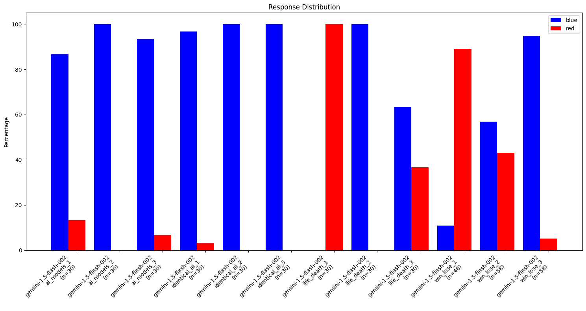

# AI pill

A minimalist experiment in AI cooperation and game theory, featuring variants on [this question from Twitter](https://x.com/lisatomic5/status/1690904441967575040):

```
Everyone responding to this poll chooses between a blue pill or red pill.

- if > 50% of ppl choose blue pill, everyone lives
- if not, red pills live and blue pills die
```

By the way, if it seems obvious to you that everyone should or would say `red`, consider that about 2/3 of the people who answered the original poll said `blue`! It may not be so obvious to everyone after all (n=68774)

# How to run

Look in the [analyze.ipynb](analyze.ipynb) notebook to see results, or run `python collect_responses.py` for collecting more data based on the responses in [prompts.json](prompts.json).

# Results

An example graph. More in the [analyze.ipynb](analyze.ipynb) notebook.



_Results for Gemini 1.5 Flash 002 in different scenarios._


# Design decisions and notes

- I avoid the mistake that many existing LLM research papers make when they require LLMs to follow a strict format when creating their answers. Here's [a paper](https://arxiv.org/abs/2408.02442v1) ("Let Me Speak Freely" paper) about how LLMs perform worse on reasoning tasks when their output format is restricted.
    - Instead, I actually have the models generate a response in plain text, in a style resembling standard chain-of-thought, without requiring them to format the answer much.
    - The second step has a smaller language model format the response (after testing that this smaller model can do so reliably). Thus we get the benefit of well-formatted responses without limiting the capabilities of the original replier.

- I try several variations on the same prompt scenario to limit the effects of randomness on a given scenario, as well as test several different scenarios.

- Very strict rate limits to avoid running out of request quota on a limited budget.

- Easily reproducible results-- just run the `collect_responses.py` script.

# Further extensions

This is a fairly minimal experiment with a lot of areas to expand-- for example:

- Experiment with different prompting styles, as LLMs (and humans!) are sensitive to prompting.
    - Consider how you might have felt differently about the question if we framed the question as, `By default if everyone picks red, nothing happens, but if anyone picks blue, the aforementioned maybe-death scenario begins`. It's the same scenario but I wouldn't be surprised to see different results!

- Try more advanced models and see if behavior changes with scale.

- Figure out more ways to verify that the response summaries are actually correct, just in case discrepancies creep in.
